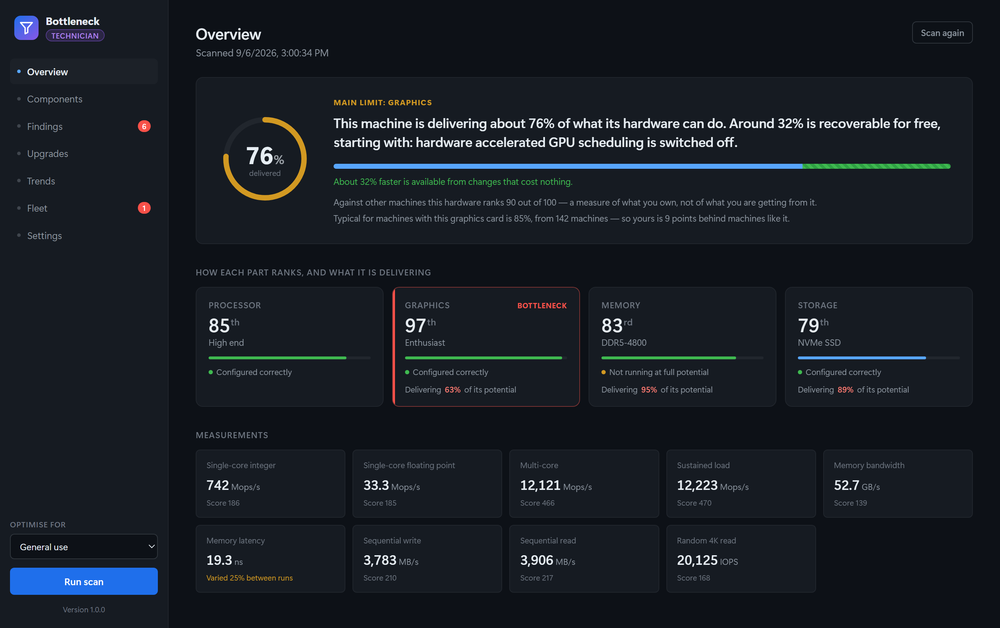

# Bottleneck — downloads

Official builds of [Bottleneck](https://www.bottleneckonline.com), a Windows application that
measures a PC, ranks what is holding it back, and shows the fix. It looks first for the problems
that cost nothing to put right — memory running below its rated speed, a monitor left at 60 Hz, a
power plan holding the processor back — and only then suggests anything you would have to buy.



This repository contains **only the released binaries**. The application source is not here and
is not public.

## Getting the application

Take them from the [latest release](https://github.com/Bottleneckonline/Bottleneck-downloads/releases/latest),
or from the [download page](https://www.bottleneckonline.com/download.html), which shows the size and
SHA-256 of each file alongside the button.

| File | What it is |
| --- | --- |
| `Bottleneck-<version>-Setup.exe` | The normal installer. Adds a Start menu entry. |
| `Bottleneck-<version>.msi` | For deployment by policy across an estate. Silent install supported. |
| `Bottleneck-<version>-Portable.zip` | Unpack and run. Writes nothing outside its own folder. |

It runs on 64-bit Windows 10 (version 1809 or later) and Windows 11. The interface uses Microsoft's
WebView2 runtime, which comes with Windows 11 and with current versions of Edge on Windows 10.
Bottleneck asks for administrator rights each time it starts, because drive health and firmware
settings cannot be read without them.

## What it checks

- **Memory** — running below its rated speed because XMP or EXPO is off, in single channel, or a
  mismatched kit.
- **Display** — a monitor running below the refresh rate it supports, or plugged into the
  motherboard instead of the graphics card.
- **Graphics** — hardware-accelerated GPU scheduling, the PCIe link, power limits, driver age,
  and graphics memory held by background applications.
- **Processor** — restrictive power plans, turbo boost switched off, and overheating.
- **Storage** — failing or worn drives, Windows on a hard disk, and NVMe drives running slower
  than they should.
- **Games** — measured frame by frame while you play, using Intel's PresentMon, to show whether
  the processor or the graphics card held the game back.

The free version scans, benchmarks and scores with no time limit. Paid licences are perpetual and
checked offline; nothing about the machine is uploaded unless you choose to share anonymous
results. See [pricing](https://www.bottleneckonline.com/pricing.html).

## The portable build

The portable zip contains the executable, its `wwwroot` folder, and a file named `portable`.
Keep all three together: the interface is served from `wwwroot`, and the marker file is what
keeps your licence, settings and scan history beside the executable instead of on the machine
you are running it from. That is the whole point of the portable build, and deleting the marker
silently turns it off.

## Checking what you downloaded

These builds are not yet code-signed, so Windows SmartScreen shows an "unknown publisher"
warning the first time you run one. Until a certificate is in place, comparing the hash is how
you confirm you have the file that was published:

```powershell
Get-FileHash .\Bottleneck-*-Setup.exe -Algorithm SHA256
```

The expected values are on each release and on the download page. They come from the build's own
manifest rather than being typed in by hand, so they cannot drift apart from the files.

## Help

Questions, licence problems and wrong-looking results:
[bottleneckonline.com/support](https://www.bottleneckonline.com/support.html), or email
sales@bottleneckonline.com. Bottleneck is made by PROMEC SYSTEMS LLC.

## A note for whoever maintains this

This repository has to stay **public**. GitHub serves release assets on a private repository
only to authenticated requests, and the download page fetches them with no credentials at all.
Making this repository private does not produce an error anybody sees — it just turns every
download button on the site into a dead link.
